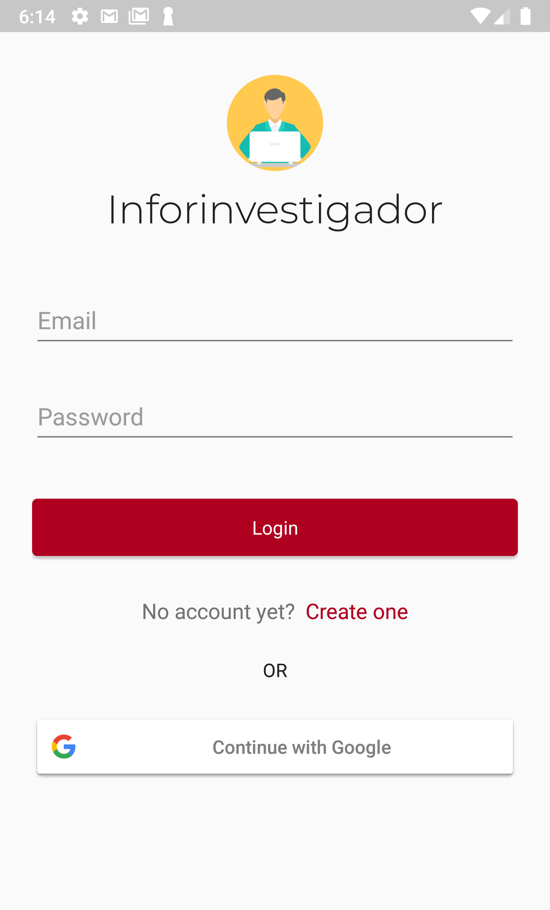

# Inforinvestigador
Inforinvestigador is a social networking app meant for helping researchers share knowledge and socialize with other peers. It can be seen as a centralized platform that allows users to share and organize papers and interact to each other through the shared content, allowing in this way a researcher to both receive feedback on the papers he shares and to find out new papers and researchers he may be interested into. 

## Key features
* [Sign-in / Sign-up](#sign-in--sign-up)
* [Papers and researchers recommendations](#Papers-and-researchers-recommendations)
* [Share papers]()
* [Social networking](#social-networking)

## Purpose of the project
Inforinvestigador has been designed and developed as a final project for the *Mobile Programming* course, held at [Università degli Studi di Brescia](www.unibs.it). The main purpose was to **learn** how to develop an Android app from scratch, becoming familiar with the Android development process and with the technologies, tools and patterns commonly adopted by the developers. As such, **the purpose of this project is purely educational** and the app is not meant to be released to the final users. However, this does not prevent the project from being further developed and actually being released someday in the future.  

## Features
### Sign-in / Sign-up
   

### Papers and researchers recommendations
  

### Share papers

### Social networking
#### Follow / Unfollow other researchers

#### Comment papers and interact with other researchers
