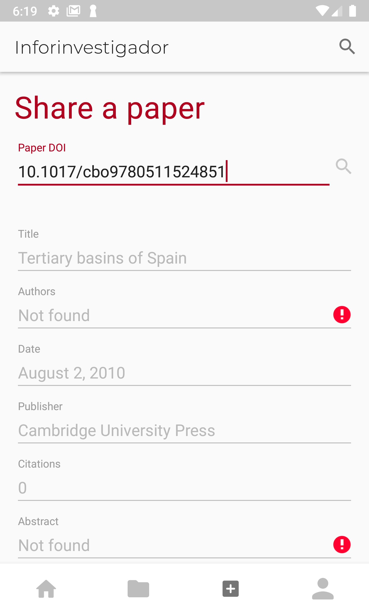
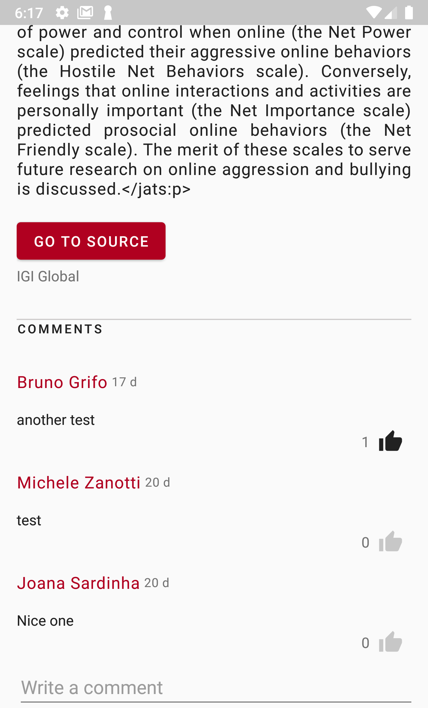

# Inforinvestigador
Inforinvestigador is a social networking app meant for helping researchers share knowledge and socialize with other peers. It can be seen as a centralized platform that allows users to share and organize papers and interact to each other through the shared content, allowing in this way a researcher to both receive feedback on the papers he shares and to find out new papers and researchers he may be interested into. 

## Key features
* [Sign-in / Sign-up](#sign-in--sign-up)
* [Papers and researchers recommendations](#Papers-and-researchers-recommendations)
* [Share papers]()
* [Social networking](#social-networking)

## Purpose of the project
Inforinvestigador has been designed and developed as a final project for the *Mobile Programming* course, held at [Università degli Studi di Brescia](www.unibs.it). The main purpose was to **learn** how to develop an Android app from scratch, becoming familiar with the Android development process and with the technologies, tools and patterns commonly adopted by the developers. As such, **the purpose of this project is purely educational** and the app is not meant to be released to the final users. However, this does not prevent the project from being further developed and actually being released someday in the future.  

## Features
### Sign-in / Sign-up
   

Sign-in/Sign-up by using your Google account or by creating a a new Inforinvestigador account. 

### Papers and researchers recommendations
  

Scroll the homefeed to find new papers (shared on Inforinvestigador by other researchers) you may be interested in, according to the researchers you follow and your research topics of interest. Swipe on a paper share to remove it from the homefeed and give the recommendations algorithm a feedback. Tap on a shared paper to open it and view its details, then leave a comment, navigate to the paper source or add it to your personal library. 

Find new researchers by scrolling the users recommendations based on both your location and your research topics of interest. 

### Share papers
  

Share on Inforinvestigador a paper you enjoyed by inserting its DOI: the app will retrieve the paper basic information and fill out the form for you. Before sharing the paper, leave a comment to let the other researchers know what you think about it.

### Social networking
#### Follow / Unfollow other researchers

#### Comment papers and interact with other researchers
